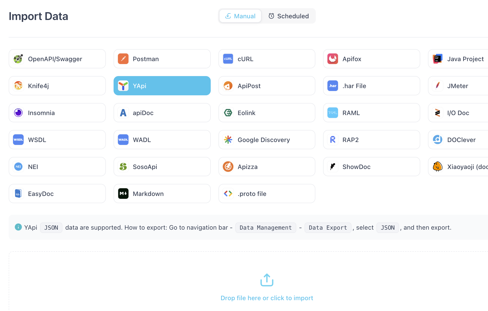
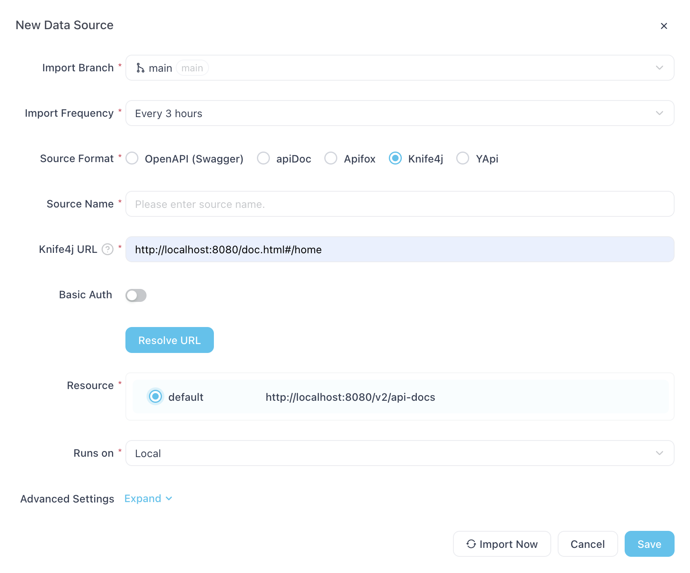
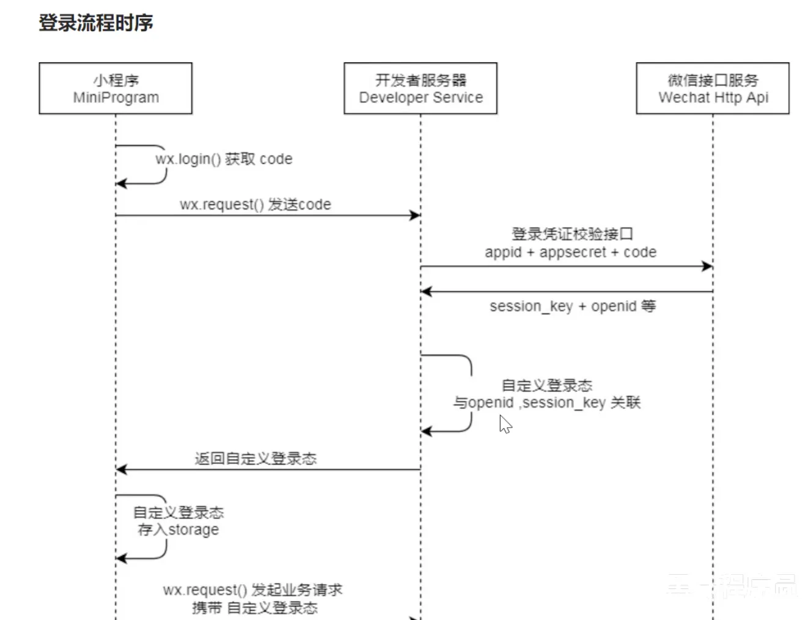
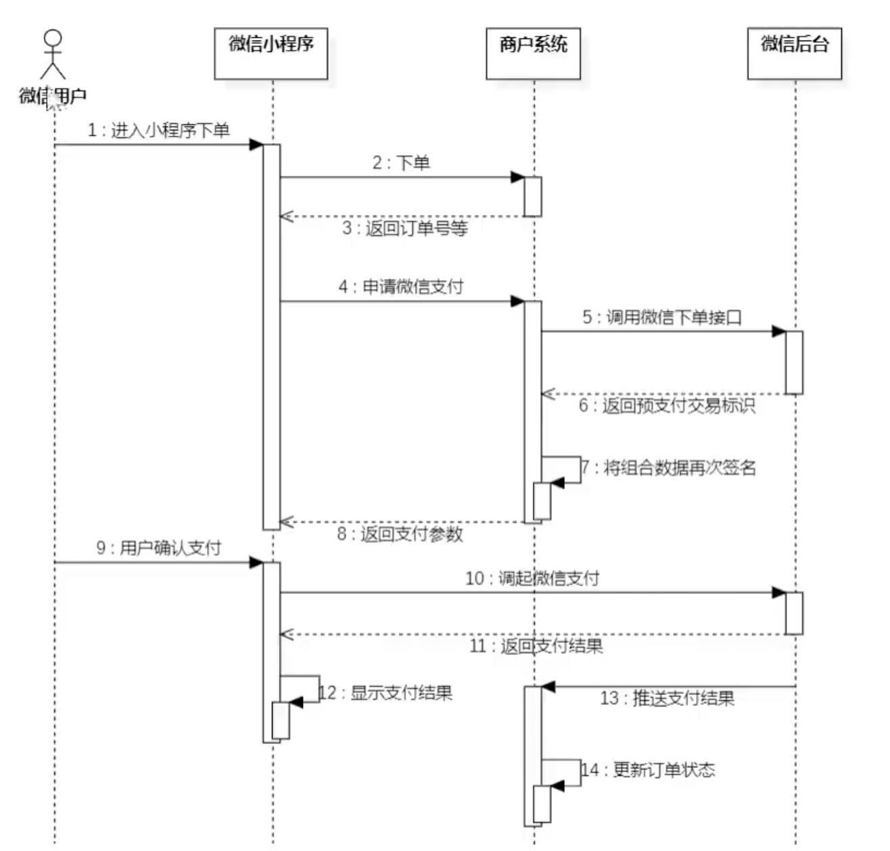
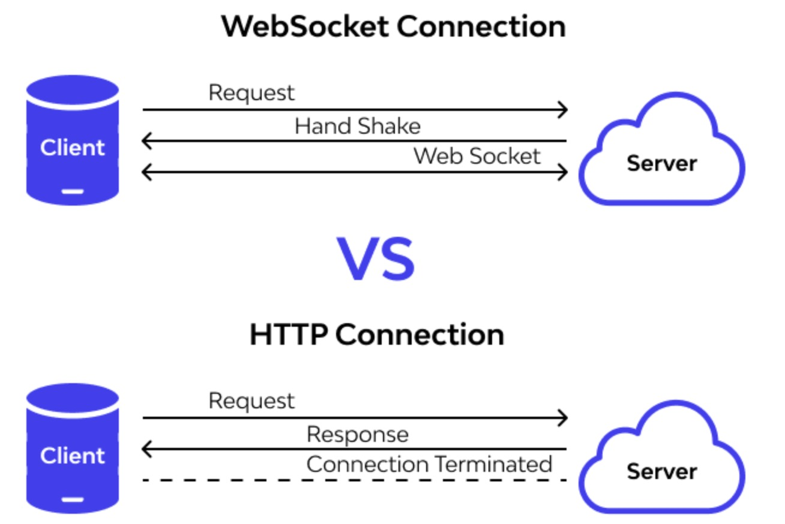

# Api Docs

## Knife4j

Knife4j is a solution for integrating Swagger in Spring MVC, providing some useful annotations for developers to generate a interface doc.
When the service starts, the api will show in http://localhost:8080/doc.html

## ApiFox
1. Develop the code according to the api doc: [business api doc in json](./assets/%E8%8B%8D%E7%A9%B9%E5%A4%96%E5%8D%96-%E7%AE%A1%E7%90%86%E7%AB%AF%E6%8E%A5%E5%8F%A3.json). This is of Yapi form.
   Import it to Apifox: 
2. Write code first, then get the api doc.
   Schedule auto-import from Knife4j:


# JWT
When an employee login, api /admin/employee/login will return a JWT token.
Once the employee send another request, this token will be carried in the request's header

## JWT structrue

JWT means Json Web Token. It's a json object used in authentication.
JWT's serialized form:
[header].[payload].[signature]

    > header:  
    {  
     "alg" : "HS256",  
     "typ" : "JWT"  
    }  
   	Payload:  
   	{  
   	 "id" : 123456789,  
   	 "name" : "Joseph"  
   	}  
   	  
   	Secret: GeeksForGeeks

Its corresponding web token:

    base64UrlEncode(header) + "." + base64UrlEncode(payload) + "." + base64UrlEncode(HMAC-SHA256(base64UrlEncode(header) + "." + base64UrlEncode(payload), secret))

1. Header specified the crypto algorithm used in JWT.
2. Payload carries the actual data.
3. Siganature: base64UrlEncode(HMAC-SHA256(base64UrlEncode(header) + "." + base64UrlEncode(payload), secret))

## JJWT Usage
Import jjwt-0.9.1.jar in the project, then use Jwts.builder() to create a JWT token.

# Interceptor
TODO

# Query Page

## Controller Layer
Return type: `Result<PageResult>`

    public class PageResult implements Serializable {  
	    private long total; 
		private List records; //当前页数据集合  
	}

## Service Layer
Return type: PageResult
Use `PageHelper.startPage(int pageNum, int pageSize)`
PageHelper will intercept the SQL query, add `LIMIT` and `OFFSET` to it.

    Page<DishVO> page=dishMapper.pageQuery(dishPageQueryDTO);
    //returned page
    {
	  "pageNum": 1,
	  "pageSize": 10,
	  "total": 100,
	  "pages": 10,
	  "result": [
	    { "id": 1, "name": "Dish 1", "price": 10.99 },
	    { "id": 2, "name": "Dish 2", "price": 12.99 },
	    { "id": 3, "name": "Dish 3", "price": 9.99 }
	  ]
	}
Then, return a PageResult

    return new PageResult(page.getTotal(), page.getResult();
# AutoFill
Once we update some information in the database, we leave a timestamp. And this feature is shared by all the insertion and update operations.

-   **Define a custom annotation `@AutoFill`**: Use this annotation to mark methods that need automatic filling of common fields.
-     @Target(ElementType.METHOD)  //indicates that this annotation is used in functions
  @Retention(RetentionPolicy.RUNTIME)  
  public @interface Autofill {  
  //类型为OperationType的参数可以被传进@AutoFill 这个注解
  OperationType value();  
  }

-   **Create a custom aspect class `AutoFillAspect`**: This aspect intercepts methods annotated with `@AutoFill` and uses reflection to assign values to common fields automatically.


		@Before("autoFillPointCut()")
		public void autoFill(JoinPoint joinPoint) throws NoSuchMethodException, InvocationTargetException, IllegalAccessException {
			log.info("开始进行公共字段自动填充");
			//jointPoint用来获取当前方法的信息
			MethodSignature signature=(MethodSignature) joinPoint.getSignature();
			Autofill autofill=signature.getMethod().getAnnotation(Autofill.class);
			OperationType operationType=autofill.value();
			//获得操作的 Entity
			Object[] args = joinPoint.getArgs();
			Object entity=args[0];
			//准备赋值的数据（当前用户的 Id）
			Long currentId= BaseContext.getCurrentId();
			//通过反射来为不同的属性赋值
			if(operationType==OperationType.INSERT){
			Method setCreateUser=entity.getClass().getDeclaredMethod(AutoFillConstant.SET_CREATE_USER, Long.class);
			setCreateUser.invoke(entity, currentId);
			}
		}`

-   **Add the `@AutoFill` annotation to methods in the Mapper**: Apply this annotation to the relevant methods in your Mapper to enable the automatic filling functionality.


		//在 Mapper方法上面加上注解
		@Autofill(value = OperationType.INSERT)
		void insert(Category category);


# WeChat Login

1. After a user click "login" in the frontend, it will do wx.login() and it returns a code, then the frontend send that code to the backend.
2. the backend use code2Session Api to send a request to Wechat Http Api. [reference](https://developers.weixin.qq.com/miniprogram/dev/OpenApiDoc/user-login/code2Session.html)
3. the backend use HttpClient to send a request to get a **OpenId**.

## Http Client
[usage reference](https://hc.apache.org/httpcomponents-client-4.5.x/current/httpclient/apidocs/org/apache/http/client/utils/package-summary.html)
Build a destination uri: it contains the hostname and the queries
public [URIBuilder](https://hc.apache.org/httpcomponents-client-4.5.x/current/httpclient/apidocs/org/apache/http/client/utils/URIBuilder.html "class in org.apache.http.client.utils") addParameter([String](https://docs.oracle.com/javase/6/docs/api/java/lang/String.html?is-external=true "class or interface in java.lang") param,
[String](https://docs.oracle.com/javase/6/docs/api/java/lang/String.html?is-external=true "class or interface in java.lang") value)

    //创建GET请求  
	HttpGet httpGet = new HttpGet(uri);  
	  
	//发送请求  
	response = httpClient.execute(httpGet);

# Cache
If too many people ordering dishes at the same time, it will create too much requests to the backend's database. Hence, we use Redis to cache the dishes in the backend.
Every time we make changes to the database, we want to clear the cache.

## Dish Cache
1. use a RedisTemplate in user/DishController, every time a user want to see the dishes in a category, it will first try to read from the cache.
2. use a RedisTemplate in admin/DishController. Every time we modify the dishes, we will clear the cache that has old value.

## Setmeal Cache
We use **Spring Cache** to cache setmeal.
Spring Cache is a framework, it provides annotations for cache. It have different implementations, we can easily switch to different options.
It's realized by AOP and Proxy.

**@CachePut:** Put the returned value in the cache.


    @CachePut(cacheNames="UserCache", key=#user.id")
    //this will generate a Redis key: "userCache::2"
    public User save(@RequestBody User user){
	    userMapper.insert(user);
	    return user
    }

**@Cacheable:** Before a function starts, it will first check if the data is in the cache. If not, call this function and put the returned value in the cache.


    @Cahceable(cacheNames="UserCache", key=#id")
    public User getById(Long id){
	    return userMapper.getById(id);
	}

# WeChat Pay

This is a **simplified** version, where we only consider successful payment. For a detailed payment process, refer to this [Official Docs](https://pay.weixin.qq.com/doc/v3/merchant/4012791911)


“微信支付下单”（Step 4)和“支付”（Step 10）是两次独立的请求

Step 5: [JSAPI](https://pay.weixin.qq.com/wiki/doc/apiv3/apis/chapter3_1_1.shtml)
We pass user's openid, app_id, merchant_id to the wechat payment  service
**notify_url:** It will be used in Step 13. When the payment completes, Wechat Server will notify our backend about the result.


	{ 	"mchid": "1900006XXX", 
		"out_trade_no": "1217752501201407033233368318", 
		"appid": "wxdace645e0bc2cXXX", 
		"description": "Image形象店-深圳腾大-QQ公仔", 
		"notify_url": "https://www.weixin.qq.com/wxpay/pay.php", 
		"amount": { "total": 1, "currency": "CNY" }, 
		"payer": { "openid": "o4GgauInH_RCEdvrrNGrntXDuXXX" }
	 }

Step 6: ` { "prepay_id": "wx26112221580621e9b071c00d9e093b0000" }`
We can get a prepay_id for this transaction.
Step 7: backend sign the information, we can get nonceStr, paySign
Step 8: Return the data to the frontend
Step 10: The frontend calls wx.requestPayment() [docs](https://pay.weixin.qq.com/wiki/doc/apiv3/apis/chapter3_5_4.shtml)
This time, WeChat server will handle this payment

	wx.requestPayment ( { 
		"timeStamp": "1414561699", 
		"nonceStr": "5K8264ILTKCH16CQ2502SI8ZNMTM67VS", //随机字符串
		"package": "prepay_id=wx201410272009395522657a690389285100", 
		"signType": "RSA", 
		//签名，使用字段appId、timeStamp、nonceStr、package计算得出的签名值
		"paySign": "oR9d8PuhnIc+YZ8cBHFCwfgpaK9gd7vaRvkYD7rthRAZ\/X+QBhcCYL21N7cHCTUxbQ+EAt6Uy+lwSN22f5YZvI45MLko8Pfso0jm46v5hqcVwrk6uddkGuT+Cdvu4WBqDzaDjnNa5UK3GfE1Wfl2gHxIIY5lLdUgWFts17D4WuolLLkiFZV+JSHMvH7eaLdT9N5GBovBwu5yYKUR7skR8Fu+LozcSqQixnlEZUfyE55feLOQTUYzLmR9pNtPbPsu6WVhbNHMS3Ss2+AehHvz+n64GDmXxbX++IOBvm2olHu3PsOUGRwhudhVf7UcGcunXt8cqNjKNqZLhLw4jq\/xDg==", 
		"success":function(res){}, 
		"fail":function(res){}, 
		"complete":function(res){} 
	} )

Step13: WeChat Server sends a POST request back to the notify_url
[callback function](https://pay.weixin.qq.com/doc/v3/partner/4012085801)


# Baidu Map Api

### API

[GetEncodedAddress](https://lbsyun.baidu.com/faq/api?title=webapi/guide/webservice-geocoding-base)

[GetRoute](https://lbs.baidu.com/faq/api?title=webapi/guide/webservice-lwrouteplanapi/dirve#%E5%9C%A8%E7%BA%BF%E8%BF%90%E8%A1%8C)
### Secure Number verification
Include an SN string in the request as a Query Param to validate this request, in case the request being modified by others.
[SN computing method](https://lbsyun.baidu.com/faq/api?title=lbscloud/api/appendix#sn%E8%AE%A1%E7%AE%97%E7%AE%97%E6%B3%95)

# Spring Task
An order can't be in status PENDING_PAYMENT or DELIVERY_IN_PROGRESS forever.

**PENDING_PAYMENT:** We check the order's status every minute, if these status last for over 15 mins, we cancel it.
**DELIVERY_IN_PROGRESS**: We check the orders on 1AM everyday. If still delivering, we mark it as COMPLETE.
### CRON Expression
[generator](https://www.freeformatter.com/cron-expression-generator-quartz.html)
CRON is an expression for some time moments, used in scheduled task

# WebSocket
WebSocket is a long-lived TCP protocol, it's different from HTTP.

Even we didn't send a request to the server, the server can send message back to us.

### Business Logic

When the client pays successsfully, we will notify the shop as soon as possible. To achieve this
1. we make the admin's page(client side) and the server be in a long-live connection.
2. When the client pays, we push messages from the server to the admin's page, using WebSocket's API.
3. Admin's page parse the messages from the server, check if it's **a Order Reminder**（来单提醒） or **Customer Expedite Request**(催单）

### Establish Connection

When we load the admin's home page, it's js function will send a handshake to the server.

    ws://localhost:8080/ws/lkt7qx03rll (socketUrl)


```
@ServerEndpoint("/ws/{sid}")
public class WebSocketServer {

    // 存放会话对象
    private static Map<String, Session> sessionMap = new HashMap<>();

    /**
     * 连接建立成功调用的方法
     */
    @OnOpen
    public void onOpen(Session session, @PathParam("sid") String sid) {
        System.out.println("客户端: " + sid + " 建立连接");
        sessionMap.put(sid, session);
    }
}
```
{sid} is lkt7qx03rll, it's an identifier for the session.
js defines a callback function: onOpen, when the connection establishes, server will put this session into the **sessionMap**.

